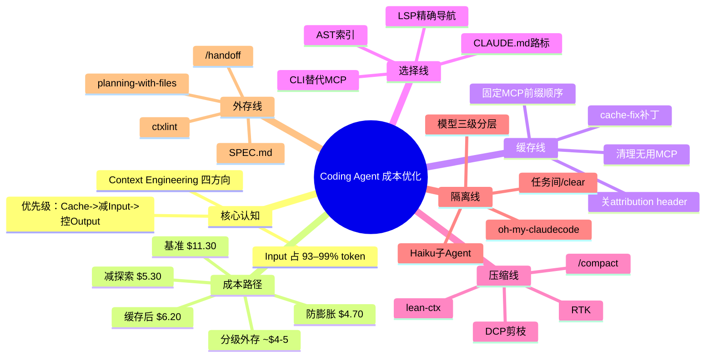

# Example: Coding Agent 成本优化

> 原文：Zhenjia Zhou《怎么优化 Coding Agent 的成本：从 Prompt Cache 到 Context Engineering 的调研笔记》
> 来源：[zhenjia.dev/posts/coding-agent-cost-optimization](https://zhenjia.dev/posts/coding-agent-cost-optimization)
> 可视化整理：Yuki

---

## Markdown 缩进格式输出

Coding Agent 成本优化路线图
- 核心认知
  - 成本大头是 Input，不是 Output
    - Input 占 token 总量 93–99%
    - Output 单价是 Input 的5倍（Opus $25 vs $5）
    - 做好缓存后 Output 反而可能变成大头（50%+）
  - 优化优先级
    - ① 让 Input 命中 Prompt Cache（便宜10倍）
    - ② 减少不必要的 Input（Context Engineering）
    - ③ 控制 Output（Input 优化到位后才凸显）
  - Context Engineering 四方向
    - Select 选择线：让正确的信息进来
    - Compress 压缩线：减少已有上下文
    - Isolate 隔离线：拆任务、换模型
    - Write 外存线：信息存到文件系统
- 成本粗算路径
  - 基准 $11.30（什么都不做）
    - Input 1.62M × $5 + Output 0.128M × $25
  - $6.20 — ① 缓存纪律（−45%）
    - 固定前缀 + 清理 MCP，70% 命中 cache
  - $5.30 — ② 减少无效探索
    - CLAUDE.md + LSP，总 token 减少 30%
  - $4.70 — ③ 预防膨胀
    - RTK / lean-ctx，再减少 15%
  - ~$4–5 — ④⑤ 模型分级 + 外存
    - Haiku 探索（便宜15倍）+ /clear + SPEC/handoff
- ① 缓存线（一次配置，长期受益）
  - 固定 MCP schema 前缀顺序
    - MCP 顺序不同 -> schema 相同也 cache miss
    - 工具定义 8–10k tokens 从 $5 降到 $0.50/MTok
  - 清理无用 MCP
    - 不用的工具 = 纯粹的缓存税
    - 能用 CLI 就不装 MCP（gh CLI vs GitHub MCP：1365 vs 44026 tokens）
  - 关 attribution header（本地模型用）
    - 每次请求开头加动态 header -> KV Cache 完全失效
    - settings.json 加 CLAUDE_CODE_ATTRIBUTION_HEADER=0
  - claude-code-cache-fix 补丁
    - resume session 嵌入时间戳 -> cache miss
    - hit rate 从 82% 提升到 95%
- ② 选择线（减少无效探索）
  - CLAUDE.md 路标
    - 控制在 200 行内（约 1500–2000 tokens）
    - 写路标不写百科：只说"去哪找"
  - LSP 精确导航
    - 比 grep 节省 5–34 倍 tokens
    - TypeScript/Rust/Go/Java 首选
  - AST / Grep 索引
    - CodeGraph（MCP 接入）/ Aider Repo Map
  - CLI 替代 MCP
    - GitHub/Jira/AWS 都有官方 CLI
- ③ 压缩线（防止 context 膨胀）
  - RTK
    - 拦截 bash 输出，语义改写后进 context
    - 30 分钟 session 整体压缩 80%
  - lean-ctx
    - 覆盖 Shell + 文件读取 + 代码分析三通道
    - 文件没变时返回 ~13 tokens 的"没变"提示
  - DCP 剪枝
    - 选择性压缩已完成对话，不是全量 /compact
    - cache hit rate 略降 90% -> 85%
  - /compact
    - context 超 70–80% 时主动触发
    - 配合 /handoff 使用效果最好
- ④ 隔离线（模型分级）
  - Haiku 子 Agent
    - 36.5% 调用跑在 Haiku，只占 2.3% 成本
    - 子 Agent 读 6100 tokens，只交 420 tokens 结论
  - 模型三级分层
    - Haiku：文件搜索、小修改
    - Sonnet：写测试、修 bug
    - Opus：架构设计、安全审查
  - 任务间 /clear
    - 不相关历史对新任务是噪音，不是资产
  - oh-my-claudecode
    - 19 个预配置 Agent + 自动路由
- ⑤ 外存线（跨 session 记忆）
  - SPEC.md 先写规格
    - 50 轮讨论 -> 2k token spec 文件 -> /clear 执行
  - planning-with-files
    - hooks 强制在 session 边界读写文件
  - /handoff
    - 压缩到 5–10% 再传给下一个 session
  - ctxlint 防漂移
    - CI 加 npx @yawlabs/ctxlint --strict
- 推荐落地顺序
  - Step 0：观测（ccusage / tokscale）
  - Step 1：缓存纪律（一次配置）
  - Step 2：CLAUDE.md + LSP（半天投入）
  - Step 3：RTK / lean-ctx（装工具）
  - Step 4：模型分级 + /clear（改习惯）
  - Step 5：SPEC.md + /handoff（改工作流）
  - Step 6：/effort + Batch API（锦上添花）

---

## Mermaid 版本（按需）

> 验证：粘贴至 [mermaid.live](https://mermaid.live) 确认渲染正常后使用。
