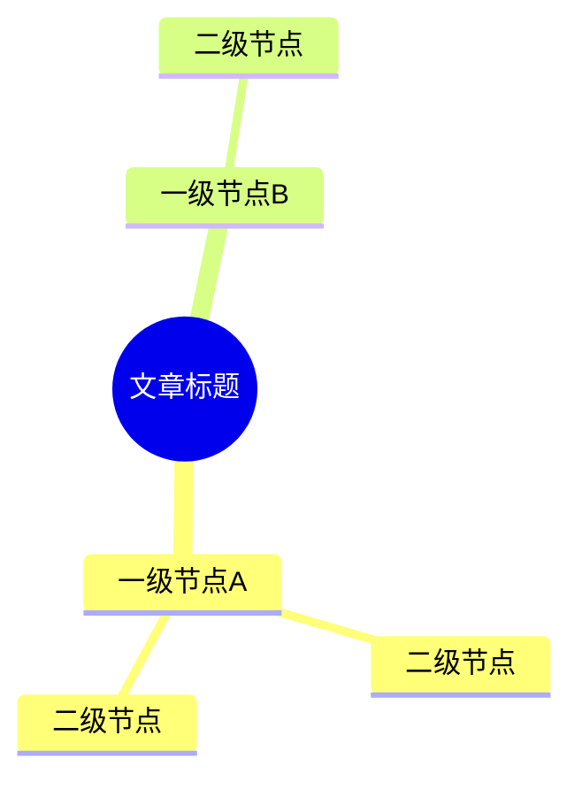

# Mindmap 生成 Prompt

用于指导 Claude 将文章内容转换为 Markdown 缩进格式思维导图。

## 适用场景

文章具备以下特征时使用：
- 有明显的层级结构（章节、子章节、要点）
- 读者需要系统理解全局，而不只是某一块细节
- 想截图分享给朋友，或导入工具做进一步整理

不适合：纯叙事文章、论证链很长的文章（可视化会丢失推理过程）。

---

## Markdown 缩进规范

```
- 一级节点（文章大章节）
  - 二级节点（核心概念/方法）
    - 三级节点（具体要点/工具/数据）
      - 四级节点（补充说明，能省则省）
```

规则：
- 缩进：**2个空格**
- 列表符：统一用 `-`
- 最多 **4层**，超过4层时主动合并到上一层
- 根节点（文章标题）不加 `-`，直接写标题
- 保留原文的数字、工具名、命令——这些是读者最需要的锚点
- 每个节点控制在 **15字以内**，超出时提炼关键词

---

## 使用方式

将以下 prompt 发给 Claude，附上文章全文：

---

```
请将这篇文章转换为 Markdown 缩进格式的思维导图。

## 格式规范
- 根节点：文章标题，不加 `-`
- 缩进：2个空格，列表符 `-`
- 最多4层，超过4层主动合并
- 每个节点 ≤15字，保留原文数字/工具名/命令
- 超过4层时，将细节合并到第3层节点的描述里

## 内容要求
- 一级节点 = 文章大章节，必须全部保留，不能遗漏
- 每个一级节点下至少有2个二级节点
- 优先保留：数字对比、工具名、操作步骤、核心结论
- 删除：过渡句、举例说明（保留例子的结论）、重复表述

## 输出
直接输出 Markdown，不需要解释。

[在此粘贴文章全文]
```

---

## 下一步：怎么用这个输出

**导入幕布（截图分享）**
1. 打开 [mubu.com](https://mubu.com)，新建文档
2. 全选输出的 Markdown，粘贴进去
3. 幕布会自动识别缩进层级
4. 导出为图片，发给朋友

**用 Markmap 渲染（交互查看）**
1. 打开 [markmap.js.org/repl](https://markmap.js.org/repl)
2. 把输出内容粘进左侧编辑区
3. 右侧实时渲染为可点击的交互图

**嵌入掘金 / GitHub（Mermaid 版）**

如果需要嵌入掘金文章或 GitHub README，在调用 prompt 时加一句：

> 「同时输出 Mermaid mindmap 格式版本」

Mermaid 注意事项：
- 节点文字不能含 `:`、`()`、`《》`——遇到时用中文全角或删除
- 最多支持约4层，超过会渲染异常
- 在 [mermaid.live](https://mermaid.live) 验证无报错后再使用



---

## 示例

见 [`example.md`](./example.md) — 用《Coding Agent 成本优化》原文生成的完整输出。
